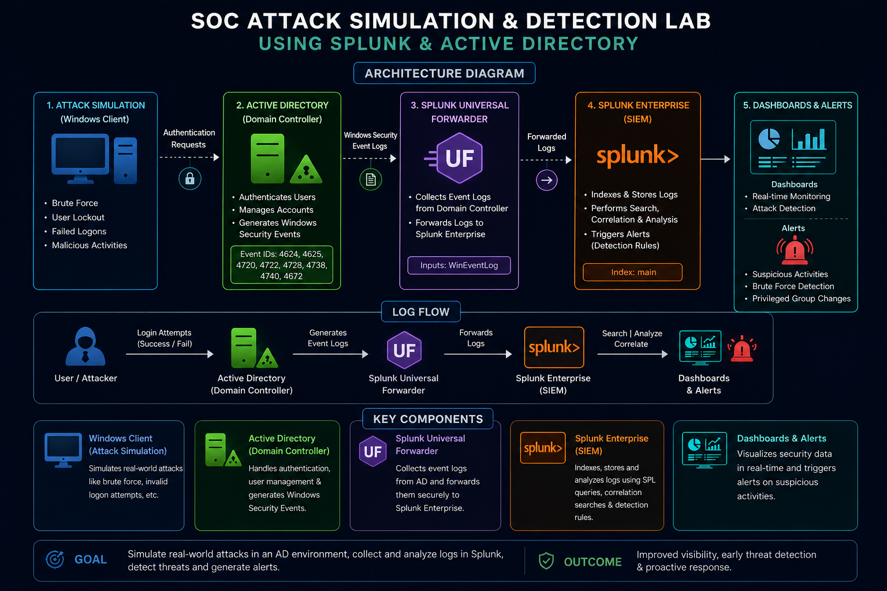
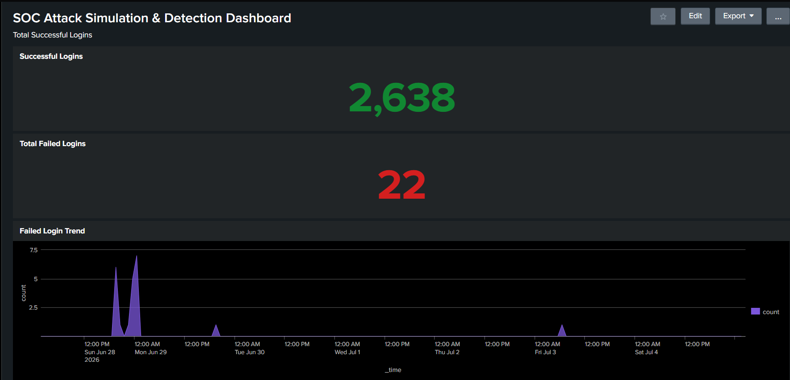

# 🛡️ SOC Attack Simulation & Detection Lab using Splunk Enterprise, Active Directory & Sysmon

A hands-on **Security Operations Center (SOC)** project that simulates Windows Active Directory attack scenarios and detects them using **Splunk Enterprise**, **Active Directory**, **Sysmon**, **SPL queries**, **interactive dashboards**, and **real-time alerts**.

This project demonstrates how a SOC Analyst can collect, analyze, investigate, and monitor Windows security events within a centralized SIEM environment.

---

## 📌 Project Overview

Modern organizations generate thousands of Windows Security Events every day. Without centralized monitoring, detecting suspicious activities such as brute-force attacks, unauthorized account creation, or privilege escalation becomes difficult.

This project builds a complete SOC monitoring lab where:

- Windows authentication events are collected.
- Active Directory activities are monitored.
- Sysmon provides enhanced endpoint telemetry.
- Splunk Enterprise centralizes log collection.
- Dashboards visualize security events.
- Alerts detect suspicious activities automatically.
- SOC investigation techniques are applied to analyze incidents.

---

# 🎯 Objectives

- Monitor Windows authentication events
- Detect brute-force login attempts
- Monitor new user account creation
- Detect password reset activities
- Monitor privileged group membership changes
- Analyze Windows Security Event Logs
- Build SOC monitoring dashboards
- Configure automated security alerts
- Perform basic incident investigation
- Map detections to the MITRE ATT&CK Framework

---

# 🏗️ Lab Architecture

The laboratory consists of a Windows Client, Active Directory Domain Controller, Sysmon, Splunk Universal Forwarder, and Splunk Enterprise.



---

# 🔄 Log Flow

```
Windows Client
        │
        ▼
Active Directory
        │
Windows Security Logs + Sysmon
        │
        ▼
Splunk Universal Forwarder
        │
        ▼
Splunk Enterprise
        │
 ┌──────────────┬─────────────┐
 │              │             │
 ▼              ▼             ▼
Dashboards   SPL Queries   Alerts
        │
        ▼
SOC Investigation
```

---

# 🚀 Key Features

- ✅ Windows Authentication Monitoring
- ✅ Active Directory Security Monitoring
- ✅ Sysmon Endpoint Monitoring
- ✅ Splunk Enterprise SIEM
- ✅ SPL Query Development
- ✅ Real-Time Dashboards
- ✅ Automated Security Alerts
- ✅ Windows Event Log Analysis
- ✅ Threat Detection
- ✅ Incident Investigation
- ✅ MITRE ATT&CK Mapping

---

# 🛠️ Technology Stack

| Technology | Purpose |
|------------|---------|
| Splunk Enterprise | SIEM Platform |
| Splunk Universal Forwarder | Log Collection |
| Microsoft Active Directory | Identity & Authentication |
| Sysmon | Endpoint Monitoring |
| Windows Server | Domain Controller |
| Windows Client | Attack Simulation |
| Windows Security Event Logs | Security Monitoring |
| SPL | Log Analysis |
| Oracle VirtualBox | Virtual Lab |

---

# 📊 Dashboard Preview

## Main Dashboard



The dashboard provides centralized visibility into:

- Successful Logins
- Failed Logins
- Failed Login Trend
- New User Creation
- User Enabled Events
- Password Reset Events
- Privileged Group Changes
- Latest Security Events
- Top Event Codes

---

# 🚨 Security Alerts

Three automated alerts were configured to detect suspicious activities.

| Alert | Purpose |
|--------|---------|
| Brute Force Detection | Detect repeated failed login attempts |
| New User Created | Detect unauthorized account creation |
| Privileged Group Change | Detect users added to privileged groups |

---

# 📑 Windows Security Event IDs

| Event ID | Description |
|----------|-------------|
| 4624 | Successful Login |
| 4625 | Failed Login |
| 4720 | User Account Created |
| 4722 | User Account Enabled |
| 4724 | Password Reset |
| 4728 | User Added to Privileged Group |

---

# 💻 Sample SPL Queries

## Successful Logins

```spl
index=main EventCode=4624
```

## Failed Logins

```spl
index=main EventCode=4625
```

## Failed Login Trend

```spl
index=main EventCode=4625
| timechart count
```

## New User Created

```spl
index=main EventCode=4720
```

## Password Reset

```spl
index=main EventCode=4724
```

## Privileged Group Changes

```spl
index=main EventCode=4728
```

More queries are available in **Queries/spl_queries.md**.

---

# 🎯 MITRE ATT&CK Mapping

| Attack Scenario | Technique | ID |
|-----------------|-----------|----|
| Brute Force Login | Brute Force | T1110 |
| Successful Login | Valid Accounts | T1078 |
| New User Creation | Create Account | T1136 |
| Password Reset | Account Manipulation | T1098 |
| Privileged Group Change | Account Manipulation | T1098 |

---

# 📂 Repository Structure

```
SOC-Attack-Simulation-Detection-Lab-Splunk-Active-Directory/
│
├── Architecture/
│   └── architecture.png
│
├── Documentation/
│   └── SOC_Attack_Simulation_Detection_Lab_Documentation.pdf
│
├── Queries/
│   └── spl_queries.md
│
├── Reports/
│   └── Incident_Report.md
│
├── Screenshots/
│   ├── Dashboard.png
│   ├── Successful_Logins.png
│   ├── Failed_Logins.png
│   ├── Failed_Login_Trend.png
│   ├── New_User_Created.png
│   ├── User_Enabled.png
│   ├── Password_Reset.png
│   ├── Privileged_Group.png
│   ├── Latest_Events.png
│   ├── Top_Event_Codes.png
│   ├── Alert_Brute_Force.png
│   ├── Alert_New_User.png
│   └── Alert_Privileged_Group.png
│
└── README.md
```

---

# 📄 Documentation

This repository includes:

- 📘 Complete Project Documentation (PDF)
- 🏗️ Architecture Diagram
- 💻 SPL Queries
- 📑 SOC Incident Report
- 📊 Dashboard Screenshots
- 🚨 Alert Configuration Examples

---

# 🎓 Skills Demonstrated

- SIEM Administration
- Splunk Enterprise
- Active Directory Monitoring
- Sysmon Deployment
- Windows Event Log Analysis
- SPL Query Development
- Dashboard Development
- Alert Configuration
- Threat Detection
- Incident Investigation
- Authentication Monitoring
- Security Documentation
- MITRE ATT&CK Mapping

---

# 🚀 Future Improvements

- Microsoft Sentinel Integration
- Sigma Rule Detection
- PowerShell Attack Detection
- RDP Attack Monitoring
- Threat Hunting Dashboards
- SOAR Integration
- Automated Incident Response

---

# 👨‍💻 Author

**Danish Mansuri**

**MCA – Cyber Security & Digital Forensics**

Aspiring SOC Analyst

GitHub: https://github.com/danishMansuri488

---

# ⭐ If you found this project useful, consider giving it a Star!
